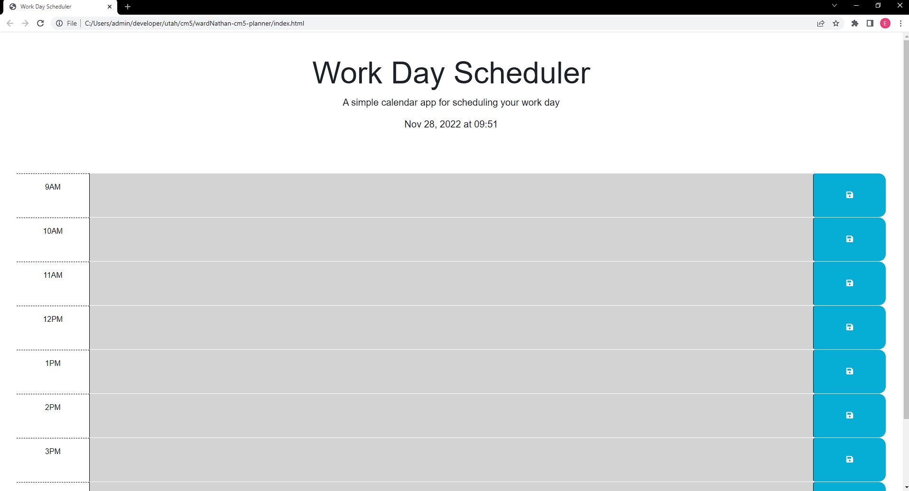

# wardNathan-cm5-planner

## Description

This project is a planner that allows you to save notes for your work day to the local storage. It will help you keep track of your tasks by indicating the present hour, and showing you which hours are coming up and which have passed. 

## Installation

N/A

## Usage

A user can click within the colored boxes to enter text and then must press the blue save button to add it to local storage. 

## Credits

N/A

## License

MIT License

## Link and Screenshot

